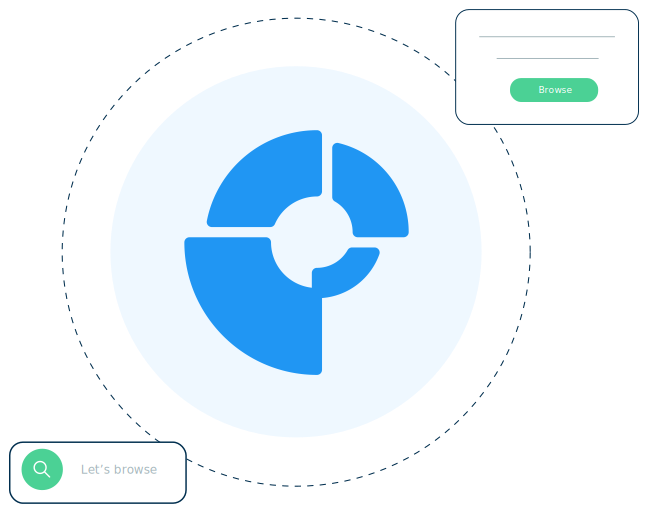

Bloom is a free, fast, open - source, web browser. It blocks ads and website trackers, and provides a way for users to customize their search experience with images that inspire from content creators.

Users decide what - if any - promoted content they elect to see and ad revenue goes to charity.

 Bloom is a free and open-source web browser based on the Chromium web browser. It blocks ads and website trackers, and provides a way for users to earn and donate to charity by simply simply using Bloom like any other browser. 
 Users can block all ads, or replace ads with custom inspiration content they create or from other content creators. 
 User choose what - if any - promoted content they see and share in the revenue generated from private promoted content.
